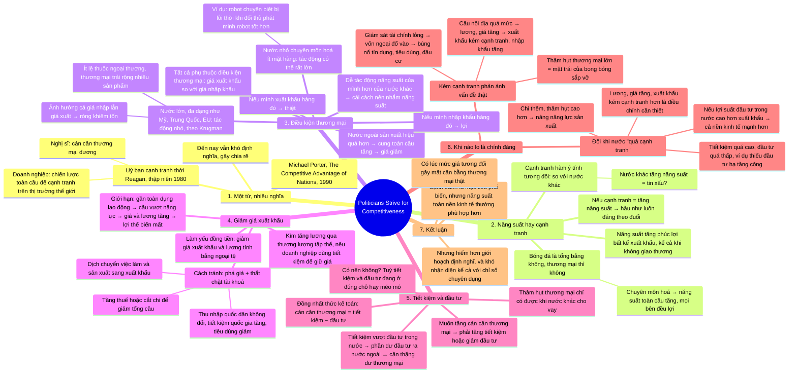

# Politicians Strive for Competitiveness — Chính trị gia theo đuổi năng lực cạnh tranh

**Nguồn:** IMF *Finance & Development*, Back to Basics, tháng 6/2025, tr. 8–9.
**Tác giả:** Kevin Fletcher, Trợ lý Giám đốc, Vụ Châu Âu của IMF.
**Ý chính:** "Năng lực cạnh tranh" là mục tiêu phổ biến nhưng mơ hồ. Trong hầu hết tình huống, năng suất mới là con đường tốt hơn tới thịnh vượng, vì thương mại thế giới không phải trò chơi tổng bằng không.

## Bản đồ tư duy

## Dàn ý chi tiết

### 1. Một từ, nhiều nghĩa

- Michael Porter trong *The Competitive Advantage of Nations* (1990) nhận xét năng lực cạnh tranh có nghĩa khác nhau với mỗi người.
- Là thành viên uỷ ban cạnh tranh của Tổng thống Reagan thập niên 1980, ông gặp lãnh đạo doanh nghiệp coi đó là chiến lược toàn cầu để cạnh tranh trên thị trường thế giới, và nghị sĩ coi đó là cán cân thương mại dương.
- Đến nay thuật ngữ này vẫn khó định nghĩa và gây chia rẽ.

### 2. Năng suất hay năng lực cạnh tranh

- Nếu tăng cạnh tranh nghĩa là tăng năng suất, các nhà kinh tế đồng ý đó hầu như luôn là mục tiêu đáng theo đuổi. Năng suất cao hơn nâng phúc lợi bất kể tác động lên xuất khẩu, kể cả khi nước đó không giao thương.
- Nhưng cạnh tranh hàm ý tính tương đối: nhà hoạch định quan tâm mức năng suất so với nước khác hơn là mức tuyệt đối. Nước khác tăng năng suất bị coi là tin xấu.
- Lo về năng suất đối thủ hợp lý trong trò chơi tổng bằng không như bóng đá: đội khác giỏi hơn thì cơ hội vô địch của đội mình giảm. Nhưng thương mại thế giới không phải tổng bằng không: chuyên môn hoá vào thứ mình làm hiệu quả nhất làm năng suất toàn cầu tăng, mọi bên đều lợi.

### 3. Điều kiện thương mại

- Nước ngoài tăng năng suất tốt hay xấu cho mình? Câu trả lời quen thuộc: tuỳ.
- Khi nước ngoài sản xuất một mặt hàng hiệu quả hơn, cung toàn cầu tăng và giá giảm. Nếu mình chủ yếu xuất khẩu mặt hàng đó, giá thế giới thấp hơn làm mình thiệt. Nếu mình chủ yếu nhập khẩu, mình lợi vì trả ít hơn.
- Tác động phụ thuộc vào **điều kiện thương mại**: giá xuất khẩu của mình so với giá nhập khẩu.
- **Nước nhỏ** chuyên môn hoá vài mặt hàng chịu tác động lớn. Ví dụ: nước nhỏ chuyên sản xuất một loại robot bị lỗi thời khi đối thủ nước ngoài phát minh robot tốt hơn, hậu quả có thể tàn khốc.
- **Nước lớn, đa dạng** như Mỹ, Trung Quốc, EU chịu tác động nhỏ, theo Paul Krugman và các nhà kinh tế khác: ít lệ thuộc ngoại thương, thương mại trải rộng nhiều sản phẩm nên năng suất nước khác ảnh hưởng cả giá nhập lẫn giá xuất, hiệu ứng ròng khiêm tốn so với lợi ích từ năng suất của chính mình.
- Tác động năng suất của mình dễ hơn của nước khác. Vì thế cải cách kinh tế ở hầu hết các nước nên nhắm vào năng suất thay vì cạnh tranh.

### 4. Chiến lược thứ hai: giảm giá xuất khẩu

- Giảm giá xuất khẩu để tăng khối lượng bán. Ở nước có thương lượng tập thể rộng, có thể kìm tăng lương, với điều kiện doanh nghiệp dùng khoản tiết kiệm để giữ giá đầu ra thấp.
- Hoặc làm yếu đồng tiền: mỗi đơn vị ngoại tệ mua được nhiều nội tệ hơn, giảm giá xuất khẩu và lương tính bằng ngoại tệ, tạo lợi thế trên thị trường nước ngoài.
- **Giới hạn:** nếu đã gần toàn dụng lao động, cầu xuất khẩu tăng vượt năng lực sản xuất, đẩy giá và lương lên, lợi thế cạnh tranh biến mất.
- **Cách tránh:** kết hợp phá giá với biện pháp giảm tổng cầu như tăng thuế hoặc cắt chi. Phá giá tăng cầu xuất khẩu, thắt chặt tài khoá giảm cầu hàng tiêu dùng nội địa. Việc làm và sản xuất dịch chuyển sang khu vực xuất khẩu. Thu nhập quốc dân không đổi, nhưng tiết kiệm quốc gia cao hơn vì chính phủ thặng dư lớn hơn (hoặc thâm hụt nhỏ hơn) và tiêu dùng nội địa thấp hơn.

### 5. Tiết kiệm và đầu tư

- Sự thật cốt lõi của kinh tế quốc tế, về mặt kế toán: **cán cân thương mại (xuất trừ nhập) bằng tiết kiệm trừ đầu tư**.
- Đầu tư được tài trợ bằng tiết kiệm. Nếu tiết kiệm vượt đầu tư trong nước, phần dư phải đầu tư ra nước ngoài, và chỉ có dòng tiền dư để làm nhà đầu tư ròng khi thặng dư thương mại. Ngược lại, thâm hụt thương mại chỉ có được khi nước khác cho vay để mua nhiều nhập khẩu hơn xuất khẩu. (Bỏ qua dòng thu nhập vốn cho đơn giản, không đổi kết luận.)
- Nếu "tăng cạnh tranh" nghĩa là tăng cán cân thương mại, chỉ làm được bằng chính sách tăng tiết kiệm quốc gia hoặc giảm đầu tư quốc gia. Có nên không? Tuỳ tiết kiệm và đầu tư đang ở đúng chỗ hay lệch xa do méo mó chính sách hoặc thất bại thị trường.

### 6. Khi nào lo là chính đáng

- **Kém cạnh tranh phản ánh vấn đề thật:** giám sát tài chính lỏng lẻo cho vốn ngoại đổ vào, tạo bùng nổ tín dụng không bền vững trong tiêu dùng và đầu tư đầu cơ. Cầu nội địa quá mức đẩy lương và giá lên, xuất khẩu kém cạnh tranh, nhập khẩu tăng. Kết quả là thâm hụt thương mại lớn, mặt trái của bong bóng tín dụng sắp vỡ và gây thiệt hại đáng kể. Đây là mối lo chính đáng.
- **Đôi khi nước "quá cạnh tranh":** tiết kiệm quá cao, đầu tư quá thấp, hoặc cả hai. Ví dụ đầu tư hạ tầng công quá ít. Chi thêm, chấp nhận thâm hụt cao hơn, có thể nâng năng lực sản xuất. Cầu đầu tư nội địa tăng sẽ đẩy lương và giá lên so với nước khác, làm xuất khẩu kém cạnh tranh hơn, nhưng đó là phần cần thiết của việc dịch chuyển năng lực từ xuất khẩu sang đầu tư trong nước. Nếu lợi suất đầu tư trong nước cao hơn khu vực xuất khẩu, cả nền kinh tế mạnh lên.

### 7. Kết luận

- Tăng cạnh tranh là mục tiêu phổ biến, nhưng tập trung vào năng suất toàn nền kinh tế, bất kể tác động lên thương mại quốc tế, thường là mục tiêu phù hợp hơn.
- Có tình huống mức giá tương đối so với đối thủ là vấn đề thật dẫn tới mất cân bằng thương mại. Nhưng chúng hiếm hơn giới hoạch định nghĩ, và khó nhận diện kể cả với các chỉ số chuyên dụng của nhà kinh tế.

## Thuật ngữ

| Thuật ngữ | Nghĩa trong bài |
|---|---|
| Competitiveness | Năng lực cạnh tranh: khái niệm tương đối, nhiều nghĩa, khó định nghĩa |
| Productivity | Năng suất: mục tiêu tuyệt đối, nâng phúc lợi kể cả không giao thương |
| Zero-sum game | Trò chơi tổng bằng không: bên này được, bên kia mất, như bóng đá, không như thương mại |
| Terms of trade | Điều kiện thương mại: giá xuất khẩu so với giá nhập khẩu |
| Collective bargaining | Thương lượng tập thể về lương |
| Exchange rate depreciation | Phá giá, làm yếu đồng tiền |
| Full employment | Toàn dụng lao động, giới hạn của chiến lược giảm giá xuất khẩu |
| Aggregate demand | Tổng cầu |
| Fiscal tightening | Thắt chặt tài khoá: tăng thuế, cắt chi |
| Trade balance = Savings − Investment | Đồng nhất thức kế toán cốt lõi của bài |
| Net investor | Nhà đầu tư ròng ra nước ngoài, đi cùng thặng dư thương mại |
| Credit-fueled boom | Bùng nổ nhờ tín dụng, không bền vững |

## Mốc và tên đáng nhớ

| Mốc | Ý nghĩa |
|---|---|
| Michael Porter, 1990 | *The Competitive Advantage of Nations*, mở đầu bài |
| Thập niên 1980 | Uỷ ban cạnh tranh thời Reagan |
| Paul Krugman | Tác động điều kiện thương mại nhỏ với nền kinh tế lớn, đa dạng |
| Mỹ, Trung Quốc, EU | Ví dụ nền kinh tế lớn, đa dạng |

## Câu nói đáng nhớ

> "A key insight from economics is that world trade is not a zero-sum game."

> "The focus of economic reforms in most countries should be increased productivity rather than increased competitiveness."
