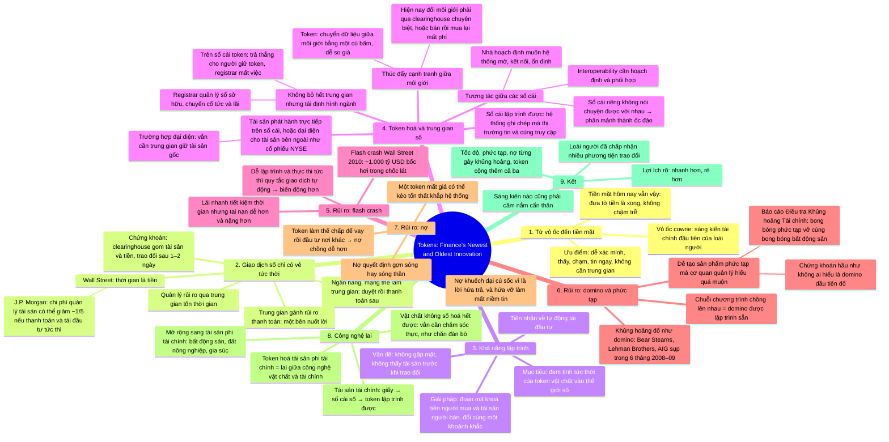

# Tokens Are Finance's Newest and Oldest Innovation — Token: sáng kiến mới nhất và cổ xưa nhất của tài chính

**Nguồn:** IMF *Finance & Development*, Back to Basics, tháng 9/2025, tr. 8–9.
**Tác giả:** Itai Agur, chuyên gia kinh tế cao cấp, Vụ Nghiên cứu của IMF. Bài dựa trên IMF Fintech Note "Tokenization and Financial Market Inefficiencies".
**Ý chính:** Tiền đã mang nhiều hình thái qua hàng thiên niên kỷ, token số là hình thái mới nhất. Token hoá đưa tính tức thời của việc trao đổi vật chất vào thế giới số, cắt chi phí trung gian, nhưng cũng khuếch đại ba nguyên nhân quen thuộc của khủng hoảng: tốc độ, độ phức tạp và nợ.

## Bản đồ tư duy

## Dàn ý chi tiết

### 1. Từ vỏ ốc đến tiền mặt

- Hàng nghìn năm trước, trước tiền xu, tiền giấy, thẻ tín dụng và ứng dụng ngân hàng, tổ tiên ta mua bán bằng vỏ ốc cowrie. Những token vật chất này là sáng kiến tài chính đầu tiên của loài người.
- Điểm hữu ích: dễ xác minh. Nhận một vỏ ốc, bạn thấy nó, chạm nó, tin nó có giá trị. Không cần người trung gian xác nhận giao dịch.
- Tiền mặt hôm nay vẫn vận hành như vậy: đưa tờ tiền là giao dịch xong, không chậm trễ.

### 2. Giao dịch số chỉ có vẻ tức thời

- Phía sau, ngân hàng và mạng thẻ tín dụng làm trung gian, phê duyệt rồi thanh toán sau. Họ gánh rủi ro thanh toán, tức nguy cơ một bên nuốt lời, và bảo đảm cả hai bên giữ lời hứa.
- Quản lý rủi ro thanh toán qua trung gian tốn thời gian. Điều này tốn kém nhất khi giao dịch cổ phiếu, trái phiếu và chứng khoán khác: clearinghouse gom tài sản của người bán và tiền của người mua, rồi trao đổi một hai ngày sau.
- Ở Wall Street, thời gian là tiền. J.P. Morgan ước tính chi phí quản lý tài sản có thể giảm khoảng một phần năm nếu thanh toán giao dịch và tái đầu tư tiền bán được diễn ra tức thì.

### 3. Khả năng lập trình

- Các nhà đổi mới tài chính muốn cắt chi phí trung gian bằng cách đem tính tức thời của việc trao token vật chất vào thế giới số.
- Thách thức: các bên không gặp mặt nên không thấy tài sản trước khi hoàn tất trao đổi.
- Giải pháp là khả năng lập trình: một đoạn mã khoá tiền của người mua và tài sản của người bán, rồi trao đổi chúng cùng một khoảnh khắc. Tiền nhận về có thể tự động tái đầu tư, tiết kiệm thời gian và tiền.

### 4. Token hoá và trung gian số

- **Định nghĩa:** token hoá tạo tài sản trên một sổ cái lập trình được, tức hệ thống ghi chép giao dịch tài chính mà các bên tham gia thị trường tin tưởng và cùng chia sẻ quyền truy cập.
- Tài sản như cổ phiếu hay trái phiếu có thể phát hành trực tiếp trên sổ cái, hoặc là đại diện cho tài sản tồn tại bên ngoài, ví dụ cổ phiếu trên Sở giao dịch New York. Trường hợp sau vẫn cần một trung gian giữ an toàn tài sản gốc ở hậu trường.
- **Cạnh tranh giữa môi giới:** quy định thường buộc nhà đầu tư dùng môi giới. Chuyển tài sản giữa các môi giới rất phiền, cần clearinghouse chuyên biệt, hoặc phải bán hết rồi mua lại qua môi giới khác và chịu phí giao dịch. Token hoá cho phép chuyển dữ liệu giữa môi giới bằng một cú bấm, giúp nhà đầu tư dễ so giá và đổi môi giới.
- **Tái định hình ngành:** token hoá không loại bỏ mọi trung gian nhưng giảm nhu cầu với một số vai trò. Registrar là trung gian quản lý sổ sở hữu tài sản và chuyển cổ tức, lãi từ doanh nghiệp tới chủ sở hữu. Trên sổ cái token, các khoản này trả thẳng cho người giữ token, tự động hoá và xoá bỏ vai trò registrar.
- **Tương tác giữa các sổ cái:** token hoá hiệu quả nhất khi tiền và tài sản lưu chuyển trơn tru. Nếu mỗi công ty xây sổ cái riêng không nói chuyện được với nhau, hệ thống tài chính có thể phân mảnh thành các ốc đảo. Có thể thiết kế sổ cái tương tác được, nhưng cần hoạch định và phối hợp. Đó là lý do nhà hoạch định chính sách muốn hệ thống token hoá luôn mở, kết nối và ổn định.

### 5. Rủi ro thứ nhất: flash crash

- Hiệu quả cao hơn không miễn phí. Lái xe nhanh tiết kiệm thời gian nhưng khiến tai nạn dễ xảy ra hơn và nghiêm trọng hơn. Thị trường tài chính cũng vậy.
- Giao dịch tự động nhanh hơn đã gây ra các cú sập đột ngột gọi là flash crash, như flash crash Wall Street năm 2010, khi ước tính 1.000 tỷ USD giá trị cổ phiếu niêm yết bốc hơi trong chốc lát.
- Bằng cách khiến việc lập trình và thực thi tức thì các quy tắc giao dịch tự động dễ hơn, thị trường token hoá có thể rủi ro và biến động hơn.

### 6. Rủi ro thứ hai: domino và độ phức tạp

- Khủng hoảng tài chính thường diễn ra như domino đổ, một thất bại kéo theo thất bại tiếp, như năm 2008–09 khi Bear Stearns, Lehman Brothers và AIG cùng sụp đổ trong vòng sáu tháng.
- Trên sổ cái token, các chuỗi chương trình có thể viết chồng lên nhau, hoạt động như một bộ domino được lập trình sẵn khi khủng hoảng.
- Token hoá và khả năng lập trình cũng khiến việc tạo sản phẩm tài chính phức tạp dễ hơn, với rủi ro mà cơ quan quản lý có thể không hiểu đầy đủ cho đến khi quá muộn. Điều này từng đúng với các tài sản không lập trình được đã đổ vỡ năm 2008–09. Báo cáo Điều tra Khủng hoảng Tài chính kết luận một "bong bóng phức tạp" đã vỡ cùng lúc với bong bóng bất động sản: "Những chứng khoán hầu như không ai hiểu, được bảo đảm bằng các khoản thế chấp mà không người cho vay nào ký 20 năm trước, là những quân domino đầu tiên đổ trong khu vực tài chính."
- Khả năng lập trình làm bức tranh tài chính vốn đã phức tạp càng khó theo dõi rủi ro.

### 7. Rủi ro thứ ba: nợ

- Mức nợ giữa các bên tham gia thị trường thường quyết định một gợn sóng hay một cơn sóng thần tài chính.
- Nợ khuếch đại cú sốc vì nó là lời hứa trả, và không gì làm lung lay niềm tin bằng lời hứa trả nợ bị vỡ.
- Token hoá có thể khiến tích nợ dễ hơn: nhà đầu tư hoặc tổ chức dùng token làm thế chấp để vay rồi đầu tư tiền đó nơi khác. Nếu một mắt xích hỏng, chẳng hạn một token mất giá, tổn thất có thể lan khắp hệ thống.

### 8. Công nghệ lai

- Tài sản tài chính khởi đầu là hồ sơ giấy, tiến hoá thành sổ cái số rồi token lập trình được. Xu hướng này đang mở rộng sang tài sản phi tài chính như bất động sản, thậm chí thế chấp nông nghiệp như đất canh tác và gia súc.
- Nhưng tài sản vật chất không số hoá hoàn toàn được, chúng vẫn cần chăm sóc thực để giữ giá trị, như nông dân chăm đàn bò hay đồng cỏ.
- Token hoá tài sản phi tài chính vì thế nên được xem là lai giữa công nghệ vật chất và công nghệ tài chính.

### 9. Kết

- Từ vỏ ốc cổ đại đến token số hôm nay, xã hội loài người đã chấp nhận nhiều phương tiện trao đổi khác nhau.
- Sáng kiến mới nhất mang lợi ích rõ: giao dịch nhanh hơn, rẻ hơn. Nhưng tốc độ, độ phức tạp và nợ rủi ro đều từng góp phần vào các khủng hoảng trước, và token hoá cộng thêm vào cả ba.
- Như mọi sáng kiến, token số cần được cầm nắm cẩn thận.

## Thuật ngữ

| Thuật ngữ | Nghĩa trong bài |
|---|---|
| Token | Vật đại diện giá trị, từ vỏ ốc đến đơn vị số trên sổ cái |
| Intermediary | Trung gian: ngân hàng, mạng thẻ, môi giới, clearinghouse, registrar |
| Settlement risk | Rủi ro thanh toán: một bên không thực hiện phần của mình |
| Clearinghouse | Trung tâm bù trừ, gom tài sản và tiền rồi trao đổi sau 1–2 ngày |
| Programmability | Khả năng lập trình: mã tự động khoá và trao đổi tiền với tài sản cùng lúc |
| Tokenization | Token hoá: tạo tài sản trên sổ cái lập trình được |
| Programmable ledger | Sổ cái lập trình được, hệ thống ghi chép mà thị trường cùng tin và truy cập |
| Registrar | Trung gian quản lý sổ sở hữu và chuyển cổ tức, lãi |
| Interoperability | Khả năng tương tác giữa các sổ cái |
| Flash crash | Cú sập giá đột ngột do giao dịch tự động |
| Complexity bubble | Bong bóng phức tạp, sản phẩm không ai hiểu, theo Báo cáo Điều tra Khủng hoảng Tài chính |
| Collateral | Thế chấp, token có thể dùng để vay |
| Hybrid technology | Công nghệ lai giữa vật chất và tài chính khi token hoá tài sản thực |

## Số liệu và mốc đáng nhớ

| Con số | Ý nghĩa |
|---|---|
| 1–2 ngày | Thời gian clearinghouse thanh toán giao dịch chứng khoán |
| ~1/5 | Mức giảm chi phí quản lý tài sản nếu thanh toán tức thì, theo J.P. Morgan |
| 2010 | Flash crash Wall Street, ~1.000 tỷ USD bốc hơi chốc lát |
| 2008–09, 6 tháng | Bear Stearns, Lehman Brothers, AIG cùng sụp |
| 20 năm | Khoảng lùi mà không người cho vay nào chấp nhận các khoản thế chấp gây khủng hoảng |

## Câu nói đáng nhớ

> "Financial crises often unfold like falling dominoes, with one failure setting off the next."

> "Speed, complexity, and risky debt have all contributed to previous financial crises—and tokenization adds to all of them."
