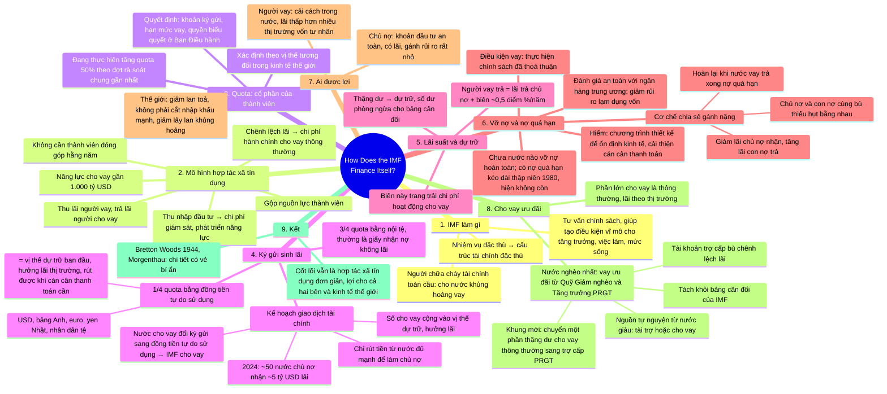

# How Does the IMF Finance Itself? — IMF tự tài trợ bằng cách nào?

**Nguồn:** IMF *Finance & Development*, Back to Basics, tháng 12/2025, tr. 8–9.
**Tác giả:** Anna Postelnyak, chuyên viên nghiên cứu cao cấp, Vụ Chiến lược, Chính sách và Rà soát (Strategy, Policy, and Review Department) của IMF.
**Ý chính:** Hãy hình dung IMF như một hợp tác xã tín dụng của các quốc gia: tự nuôi mình bằng lãi thu từ nước vay trừ đi lãi trả cho nước cho vay, với năng lực cho vay gần 1.000 tỷ USD.

## Bản đồ tư duy

## Dàn ý chi tiết

### 1. IMF làm gì

- Được biết đến nhiều nhất với vai trò cho nước gặp khủng hoảng vay, nhưng IMF không chỉ là "người chữa cháy tài chính toàn cầu".
- IMF còn là nguồn tư vấn chính sách thiết yếu, giúp thành viên tạo điều kiện vĩ mô đúng để thúc đẩy tăng trưởng, tạo việc làm, nâng mức sống.
- Nhiệm vụ đặc thù này đi kèm cấu trúc tài chính đặc thù.

### 2. Mô hình hợp tác xã tín dụng của các quốc gia

- IMF gộp nguồn lực của thành viên, thu lãi từ nước đi vay và trả lãi cho nước cho vay.
- Chênh lệch giữa hai mức lãi trang trải chi phí hành chính cho hoạt động cho vay thông thường, không ưu đãi.
- Thu nhập từ đầu tư trang trải các chi phí khác như giám sát và phát triển năng lực.
- Vì thế, khác nhiều tổ chức quốc tế, IMF không yêu cầu thành viên đóng góp hằng năm.
- Năng lực cho vay gần 1.000 tỷ USD.

### 3. Quota

- Khi gia nhập, mỗi nước được gán một quota, dựa rộng rãi trên vị thế tương đối trong kinh tế thế giới.
- Quota quyết định ba thứ: khoản ký gửi tài chính vào IMF, hạn mức được vay, và quyền biểu quyết tại Ban Điều hành.
- Để bảo đảm đủ nguồn cho vay, IMF đang cùng thành viên thực hiện tăng quota 50% theo đợt rà soát chung gần nhất.

### 4. Ký gửi sinh lãi

- **Một phần tư quota** ký gửi bằng "đồng tiền tự do sử dụng": các đồng tiền dùng phổ biến nhất trong giao dịch quốc tế và được giao dịch rộng rãi trên thị trường ngoại hối. Hiện gồm USD, bảng Anh, euro, yen Nhật và nhân dân tệ.
- Phần này là **vị thế dự trữ ban đầu** của thành viên trên sổ sách IMF. Thành viên hưởng lãi theo thị trường và có thể rút toàn bộ khi cán cân thanh toán cần.
- **Ba phần tư còn lại** ký gửi bằng nội tệ, thường dưới dạng giấy nhận nợ không lãi.
- **Kế hoạch giao dịch tài chính:** khi cho vay, IMF chỉ rút tiền từ những nước có kinh tế đủ mạnh để làm chủ nợ. Nước được gọi sẽ đổi khoản ký gửi sang một trong năm đồng tiền tự do sử dụng, IMF dùng số đó cho vay. Số tiền cho vay được cộng vào vị thế dự trữ của nước đó và hưởng lãi thị trường.
- **Số liệu:** năm 2024, khoảng 50 nước chủ nợ nhận tổng cộng khoảng 5 tỷ USD tiền lãi từ nguồn lực đã cung cấp cho vay thông thường.

### 5. Lãi suất và dự trữ

- Lãi suất người vay trả bằng lãi IMF trả cho chủ nợ cộng một biên, hiện khoảng nửa điểm phần trăm mỗi năm.
- Thu nhập này trang trải chi phí hành chính của hoạt động cho vay. Thặng dư còn lại thường đưa vào dự trữ để xây dựng số dư phòng ngừa, làm nền cho bảng cân đối của IMF.

### 6. Vỡ nợ và nợ quá hạn

- Hiếm xảy ra, vì chương trình do IMF hỗ trợ được thiết kế để nền kinh tế người vay ổn định và cán cân thanh toán cải thiện, đủ sức trả nợ khi đến hạn.
- **Điều kiện vay** bảo đảm nước vay thực hiện chính sách đã thoả thuận. Ngân hàng trung ương của nước vay phải qua **đánh giá an toàn** để giảm rủi ro lạm dụng vốn.
- Chưa nước nào vỡ nợ hoàn toàn với IMF, dù đã có trường hợp nợ quá hạn kéo dài, nhất là trong khủng hoảng nợ thập niên 1980. Hiện không có trường hợp nào.
- **Cơ chế chia sẻ gánh nặng:** khi một nước chậm trả lãi, mọi thành viên chủ nợ và con nợ cùng tài trợ tạm thời với số tiền bằng nhau, bằng cách giảm lãi chủ nợ nhận trên vị thế dự trữ và tăng lãi con nợ trả. Các khoản này được hoàn lại khi nước vay trả xong nợ quá hạn.

### 7. Ai được lợi

- **Chủ nợ:** đầu tư an toàn. Hưởng lãi trên quota cho vay trong khi chỉ gánh một phần nhỏ rủi ro.
- **Người vay:** thiết kế chương trình và điều kiện vay hỗ trợ cải cách trong nước, nhờ đó tiếp cận vốn rẻ. Lãi IMF thấp hơn nhiều so với mức nước khủng hoảng phải trả trên thị trường vốn tư nhân, nếu còn vay được.
- **Kinh tế thế giới:** giảm rủi ro lan toả. Không có IMF, nước khủng hoảng phải cắt nhập khẩu mạnh, hại cả nhà sản xuất, người tiêu dùng trong nước lẫn đối tác thương mại. Cho vay của IMF cũng giảm nguy cơ lây lan khủng hoảng từ nước này sang nước khác.

### 8. Cho vay ưu đãi

- Phần lớn cho vay của IMF là thông thường, người vay trả lãi theo thị trường.
- Với thành viên nghèo nhất, IMF cho vay ưu đãi rẻ hơn, dùng nguồn lực các thành viên giàu tự nguyện đóng góp, gộp trong **Quỹ Giảm nghèo và Tăng trưởng (PRGT)**, tách khỏi bảng cân đối của IMF.
- Thành viên đóng góp cho PRGT tự chọn tài trợ không hoàn lại hoặc cho vay. Vì người vay trả rất ít hoặc không trả lãi, chênh lệch giữa lãi người vay trả và lãi chủ nợ nhận được bù bằng **tài khoản trợ cấp**, tài trợ từ đóng góp tự nguyện và nguồn lực của IMF.
- Thành viên gần đây lập khung cho phép chuyển một phần thặng dư từ cho vay thông thường sang trợ cấp cho PRGT.

### 9. Kết

- Tại Hội nghị Bretton Woods lập ra IMF năm 1944, Bộ trưởng Tài chính Mỹ Henry Morgenthau nhận xét chi tiết của thoả thuận tiền tệ và tài chính quốc tế có vẻ "bí ẩn".
- Nhưng ở cốt lõi, IMF là một hợp tác xã tín dụng đơn giản: tự tài trợ bằng lãi thu từ người vay trừ lãi trả cho chủ nợ, có lợi cho cả hai bên và cho kinh tế thế giới.

## Thuật ngữ

| Thuật ngữ | Nghĩa trong bài |
|---|---|
| Quota | Cổ phần của thành viên: quyết định ký gửi, hạn mức vay, quyền biểu quyết |
| Freely usable currencies | Đồng tiền tự do sử dụng: USD, GBP, EUR, JPY, CNY |
| Reserve tranche position | Vị thế dự trữ: phần ký gửi hưởng lãi, rút được khi cần |
| Promissory note | Giấy nhận nợ, thường không lãi, cho phần ký gửi bằng nội tệ |
| Financial transactions plan | Kế hoạch giao dịch tài chính: danh sách nước đủ mạnh để cho vay |
| Non-concessional lending | Cho vay thông thường, lãi theo thị trường |
| Concessional lending | Cho vay ưu đãi cho nước nghèo nhất |
| PRGT | Poverty Reduction and Growth Trust, quỹ tách riêng cho vay ưu đãi |
| Subsidy account | Tài khoản trợ cấp bù chênh lệch lãi cho vay ưu đãi |
| Conditionality | Điều kiện vay: cam kết chính sách nước vay phải thực hiện |
| Safeguards assessment | Đánh giá an toàn với ngân hàng trung ương nước vay |
| Burden-sharing mechanism | Cơ chế chia sẻ gánh nặng khi có nợ quá hạn |
| Precautionary balances | Số dư phòng ngừa, dự trữ làm nền cho bảng cân đối |
| Spillovers, contagion | Lan toả, lây lan khủng hoảng giữa các nước |

## Số liệu đáng nhớ

| Con số | Ý nghĩa |
|---|---|
| Gần 1.000 tỷ USD | Năng lực cho vay của IMF |
| 50% | Mức tăng quota theo đợt rà soát chung gần nhất |
| 1/4 và 3/4 | Phần quota ký gửi bằng đồng tiền tự do sử dụng và bằng nội tệ |
| 5 đồng tiền | USD, GBP, EUR, JPY, CNY |
| ~50 nước, ~5 tỷ USD | Số chủ nợ và tổng lãi nhận năm 2024 |
| ~0,5 điểm %/năm | Biên lãi người vay trả thêm so với lãi trả chủ nợ |
| 0 | Số nước từng vỡ nợ hoàn toàn với IMF |
| 1944 | Hội nghị Bretton Woods lập ra IMF |

## Câu nói đáng nhớ

> "The IMF's unique mandate comes with a unique financial structure."

> "At its core, the IMF is a simple credit union that funds itself through the interest it charges borrowers, minus the interest it pays to creditors."
