# The Art of Taxation — Nghệ thuật đánh thuế

**Nguồn:** IMF *Finance & Development*, Back to Basics, tháng 3/2026, tr. 8–9.
**Tác giả:** Katherine Baer và Ruud de Mooij, Phó Vụ trưởng Vụ Tài chính công (Fiscal Affairs Department) của IMF.
**Ý chính:** Huy động nguồn thu trong nước (domestic revenue mobilization) là nền tảng của phát triển. Thành công không chỉ nằm ở thiết kế thuế mà ở bộ máy thực thi và niềm tin của người dân.

## Bản đồ tư duy

```mermaid
mindmap
  root((The Art of Taxation<br/>Nghệ thuật đánh thuế))
    1. Vì sao cần thuế
      Chính phủ nào cũng cần tiền: đường, trường, bệnh viện, toà án, an ninh
      Vay nợ hay viện trợ đều có, nhưng thuế là nguồn bền vững nhất
      Bài toán cân bằng
        Đủ thu để lo dịch vụ công
        Thuế quá cao, thiết kế kém, thu kém → bóp nghẹt đầu tư, đổi mới, tăng trưởng
      Ngày càng khó
        Nợ công và thâm hụt cao
        Dân số già, nghèo đói, áp lực chi cho giáo dục, y tế, hạ tầng số, khí hậu
    2. Huy động nguồn thu trong nước
      Thu thuế bền vững, hiệu quả, công bằng
      Quyết định tài trợ ưu tiên, giảm lệ thuộc viện trợ, chống chịu cú sốc
      Mang tính chính trị sâu sắc: ai nộp, bao nhiêu, dưới hình thức nào = khế ước xã hội
      Mốc tham chiếu: thu thuế tối thiểu 15% GDP
        Dưới mức này hiệu lực nhà nước, tài chính, tăng trưởng đình trệ
        Hơn 70 nước đang phát triển vẫn dưới 15%
      Tiềm năng chưa khai thác: thêm 4–5% GDP nhờ cải cách tốt
        Jamaica, Maldives, Morocco, Nepal, Rwanda, Uzbekistan
    3. Các loại thuế
      Xu hướng: từ thuế hẹp, méo mó sang thuế rộng, hiệu quả
      Thuế thương mại và thuế quan
        Dễ thu ở biên giới, từng là nguồn chính
        Giảm từ giữa thế kỷ 20, vẫn chiếm ~1/4 thu thuế ở nhiều nước đang phát triển
        Lạm dụng → cản thương mại, tăng giá tiêu dùng, chậm hội nhập
      VAT: con ngựa thồ
        Hơn 1/3 tổng thu thuế, kể cả nước thu nhập thấp và trung bình
        Đánh rộng trên tiêu dùng, khấu trừ đầu vào → giảm thuế chồng thuế
      Thuế tiêu thụ đặc biệt
        Thuốc lá, rượu, nhiên liệu hoá thạch
        Vừa thu ngân sách vừa cải thiện sức khoẻ, môi trường
      Thuế thu nhập doanh nghiệp
        Quan trọng để đánh vào lợi nhuận công ty lớn, đa quốc gia
        Áp lực: cạnh tranh thuế quốc tế, chuyển lợi nhuận → cần phối hợp quốc tế
      Thuế thu nhập cá nhân
        Thu ít ở nước đang phát triển: tầng lớp trung lưu nhỏ, phi chính thức lớn, tự làm chủ, tài chính chính thức hạn chế
        Vẫn tiến bộ được: châu Phi tăng gấp đôi tỉ lệ trên GDP từ 2000
        Quan trọng cho tính luỹ tiến
      Thuế tài sản: đất và bất động sản
        Bị bỏ quên, khó trốn, hiệu quả cho ngân sách địa phương
        Rào cản: phản đối chính trị, sổ đăng ký lạc hậu
    4. Thiết kế thuế
      Mục tiêu: thu đủ, ít méo mó, ít bất công
      Nguyên tắc trung lập: ít can thiệp vào quyết định làm việc, tiết kiệm, đầu tư, tiêu dùng
        Thực tế = cơ sở thuế rộng, thuế suất vừa phải
      Chi tiêu thuế: miễn, giảm, khấu trừ, chế độ đặc biệt
        Chi phí gộp 3–4% GDP, khoảng 1/4 số thu
        Không phải cái nào cũng xấu: chế độ đơn giản cho doanh nghiệp nhỏ, ưu đãi lao động kỹ năng thấp
        Vấn đề khi tràn lan không đánh giá: méo mó, bất công, phức tạp, dễ trốn
      Cần rà soát định kỳ và minh bạch: mỗi ưu đãi có đạt mục tiêu, có phải công cụ tốt nhất
    5. Từ chính sách đến thực thi
      Chính sách tốt nhất cũng thất bại nếu thực thi kém
      Thách thức: năng lực hành chính hạn chế, khu vực phi chính thức lớn
        Riêng thất thu VAT ~3% GDP
      Mở rộng sổ đăng ký tràn lan không hiệu quả: nhiều người phi chính thức thu nhập quá thấp để phải nộp
      Chiến lược hiệu quả hơn
        Khấu trừ tại nguồn qua trung gian lớn: doanh nghiệp, ngân hàng
        Kiểm tra theo rủi ro
        Số hoá: khai nộp điện tử, hoá đơn thời gian thực, phân tích dữ liệu, AI
      Luật rõ và đơn giản: phức tạp và thay đổi liên tục → bất định, tham nhũng
      Nền tảng: nhân sự giỏi, tổ chức hiện đại, quản trị mạnh
    6. Ba bài học
      Nghĩ theo hệ thống: mức thuế, cơ cấu, thiết kế, hành chính liên kết chặt. Cải cách rời rạc hiếm khi bền
      Kiên nhẫn: thắng nhanh có thể có, nhưng bền vững cần nhiều năm, giữ đà qua các chu kỳ chính trị
      Hợp tác quốc tế giúp nhưng không đủ: trao đổi thông tin, hiệp định thuế không thay được thể chế trong nước
    7. Chính trị và niềm tin
      Thuế bị coi là tuỳ tiện, tham nhũng → tuân thủ giảm
      Thuế được coi là đóng góp cho thịnh vượng chung → ủng hộ tăng
      Minh bạch, trách nhiệm giải trình, truyền thông rõ ràng
      Nộp thuế nên là đầu tư cho tương lai chung, không phải mất của riêng
```

## Dàn ý chi tiết

### 1. Vì sao cần thuế

- Mọi chính phủ đều cần tiền để xây đường, trả lương giáo viên, cấp thuốc cho bệnh viện, vận hành toà án, bảo đảm an ninh. Đây là xương sống của mọi nền kinh tế và xã hội vận hành tốt.
- Chính phủ có thể vay hoặc nhận viện trợ, nhưng thuế là nguồn tài trợ bền vững nhất.
- **Bài toán cân bằng:** thu phải đủ cho dịch vụ công, nhưng thuế quá cao, thiết kế kém hoặc quản lý tồi sẽ bóp nghẹt đầu tư, đổi mới và tăng trưởng.
- **Ngày càng khó** vì nợ công và thâm hụt cao trong khi nhu cầu chi tăng: dân số già, nghèo đói, áp lực đầu tư cho giáo dục, y tế, hạ tầng số, chống chịu khí hậu.

### 2. Huy động nguồn thu trong nước

- **Định nghĩa:** quá trình một nước huy động nguồn lực công qua thuế theo cách bền vững, hiệu quả và công bằng. Nó quyết định chính phủ có tài trợ được ưu tiên, giảm lệ thuộc viện trợ và ứng phó cú sốc hay không.
- **Mang tính chính trị:** ai nộp thuế, bao nhiêu, dưới hình thức nào là cốt lõi của khế ước xã hội. Ít ai thích nộp thuế, nên cải cách cần cả thiết kế kinh tế lẫn quản lý chính trị khéo léo. Cuối cùng phụ thuộc vào niềm tin: hệ thống công bằng và chính phủ dùng tiền khôn ngoan.
- **Mốc 15% GDP:** dưới mức này, hiệu lực nhà nước, phát triển tài chính và tăng trưởng đình trệ. Hơn 70 nền kinh tế đang phát triển vẫn thu dưới 15%.
- **Tin tốt:** nhiều nước có thể thu thêm 4–5% GDP nhờ cải cách thiết kế tốt. Jamaica, Maldives, Morocco, Nepal, Rwanda, Uzbekistan đã chứng minh điều đó gần đây, ngay trong bối cảnh khó khăn.

### 3. Các loại thuế

- **Xu hướng chung:** rời xa thuế hẹp và méo mó, tiến tới thuế rộng và hiệu quả hơn.
- **Thuế thương mại, thuế quan:** từng là nguồn thu quan trọng vì dễ thu ở biên giới. Giảm toàn cầu từ giữa thế kỷ 20 nhờ toàn cầu hoá, nhưng vẫn chiếm khoảng một phần tư thu thuế ở nhiều nước đang phát triển. Lạm dụng sẽ cản thương mại, tăng giá tiêu dùng, chậm hội nhập.
- **VAT:** "con ngựa thồ" của hệ thống thu, tạo hơn một phần ba tổng thu thuế, kể cả ở nhiều nước thu nhập thấp và trung bình. Hiệu quả vì đánh rộng trên tiêu dùng và cho doanh nghiệp khấu trừ thuế đầu vào, giảm hiệu ứng thuế chồng thuế dọc chuỗi cung ứng.
- **Thuế tiêu thụ đặc biệt:** bổ trợ VAT, đánh vào hàng có chi phí xã hội như thuốc lá, rượu, hoặc hoạt động hại môi trường như đốt nhiên liệu hoá thạch. Vừa thu ngân sách vừa cải thiện sức khoẻ, môi trường.
- **Thuế thu nhập doanh nghiệp:** quan trọng để đánh vào lợi nhuận công ty lớn và đa quốc gia. Chịu áp lực từ cạnh tranh thuế quốc tế và chuyển lợi nhuận sang nơi thuế thấp, nên cải cách ngày càng phức tạp và cần phối hợp quốc tế.
- **Thuế thu nhập cá nhân:** thu tương đối ít ở nước đang phát triển do tầng lớp trung lưu nhỏ, khu vực phi chính thức lớn, nhiều người tự làm chủ, khu vực tài chính chính thức hạn chế. Vẫn tiến bộ được: ở châu Phi, tỉ lệ thu trên GDP đã tăng gần gấp đôi từ năm 2000. Quan trọng cho cả nguồn thu lẫn tính luỹ tiến.
- **Thuế tài sản trên đất và bất động sản:** bị bỏ quên đáng kể. Khó trốn, hiệu quả cho ngân sách địa phương, nhưng vấp phản đối chính trị và khó khăn hành chính như sổ đăng ký tài sản lạc hậu.

### 4. Thiết kế thuế

- **Mục tiêu:** thu ngân sách với ít méo mó kinh tế và ít bất công nhất.
- **Nguyên tắc trung lập:** thuế nên can thiệp ít nhất có thể vào quyết định làm việc, tiết kiệm, đầu tư, tiêu dùng. Trong thực tế nghĩa là cơ sở thuế rộng kết hợp thuế suất vừa phải.
- **Chi tiêu thuế (tax expenditures):** miễn, khấu trừ, thuế suất ưu đãi, chế độ đặc biệt. Chi phí gộp thường lớn, 3–4% GDP ở nhiều nước, khoảng một phần tư số thu.
- Không phải cái nào cũng xấu: chế độ đơn giản cho doanh nghiệp nhỏ giảm chi phí tuân thủ, ưu đãi cho lao động kỹ năng thấp có thể tăng việc làm. Vấn đề nảy sinh khi ưu đãi tràn lan mà không được đánh giá: méo mó, bất công, phức tạp, khó quản lý và dễ trốn.
- **Rà soát định kỳ và minh bạch:** mỗi ưu đãi có đạt mục tiêu không, có phải công cụ hiệu quả nhất không.

### 5. Từ chính sách đến thực thi

- Chính sách tốt nhất cũng thất bại nếu thực thi yếu. Hành chính kém làm xói mòn nguồn thu, phá công bằng, hại đầu tư, mất niềm tin.
- **Thách thức:** năng lực hành chính hạn chế và khu vực phi chính thức lớn. Riêng thất thu VAT đã tốn các nước đang phát triển trung bình khoảng 3% GDP.
- Mở rộng sổ đăng ký người nộp thuế một cách tràn lan thường vô ích, vì nhiều người phi chính thức thu nhập quá thấp để phải nộp.
- **Chiến lược hiệu quả hơn:** khấu trừ tại nguồn qua trung gian lớn như doanh nghiệp và ngân hàng; kiểm tra dựa trên rủi ro, tập trung vào người nộp rủi ro cao; số hoá với khai và nộp điện tử, hoá đơn thời gian thực, phân tích dữ liệu, kể cả AI.
- **Luật rõ và đơn giản:** phức tạp và thay đổi liên tục tạo bất định và mở cửa cho tham nhũng. Nhiều nước vẫn cần củng cố nền tảng: nhân sự giỏi, cơ cấu tổ chức hiện đại, quản trị mạnh.

### 6. Ba bài học từ kinh nghiệm các nước

1. **Nghĩ theo hệ thống.** Mức thuế, cơ cấu, thiết kế và hành chính gắn chặt với nhau. Cải cách rời rạc, như thêm một sắc thuế mới mà không củng cố bộ máy, hiếm khi cho kết quả bền.
2. **Kiên nhẫn.** Xây năng lực thuế mất thời gian. Thắng nhanh có thể có qua khấu trừ tại nguồn hay chỉ số hoá theo lạm phát, nhưng cải thiện bền vững cần nhiều năm nỗ lực nhất quán, giữ đà qua các chu kỳ chính trị. Bất ổn chính sách hoặc khủng hoảng dễ đảo ngược tiến bộ.
3. **Hợp tác quốc tế giúp nhưng không đủ.** Trao đổi thông tin, hiệp định thuế, thoả thuận toàn cầu về thuế doanh nghiệp đều có giá trị, nhưng không thay thế được thể chế trong nước mạnh. Kỳ vọng quá mức vào giải pháp quốc tế có thể làm sao nhãng cải cách trong nước.

### 7. Chính trị và niềm tin

- Cốt lõi của huy động nguồn thu là niềm tin. Khi người dân thấy thuế tuỳ tiện hoặc tham nhũng, tuân thủ giảm. Khi họ thấy thuế là đóng góp cho thịnh vượng chung, tài trợ trường học, bệnh viện, hạ tầng, an sinh, ủng hộ tăng.
- Củng cố niềm tin có lẽ là phần khó nhất, nhưng cũng quan trọng nhất.
- Minh bạch, trách nhiệm giải trình và truyền thông rõ ràng là thiết yếu. Nộp thuế không nên là cảm giác mất của riêng, mà là đầu tư cho tương lai chung.

## Thuật ngữ

| Thuật ngữ | Nghĩa trong bài |
|---|---|
| Domestic revenue mobilization | Huy động nguồn thu trong nước qua thuế một cách bền vững, hiệu quả, công bằng |
| Social contract | Khế ước xã hội: thoả thuận ngầm giữa nhà nước và công dân về ai nộp gì, đổi lấy gì |
| Trade taxes, tariffs | Thuế thương mại, thuế quan thu ở biên giới |
| VAT | Thuế giá trị gia tăng, đánh rộng trên tiêu dùng, được khấu trừ đầu vào |
| Cascading | Thuế chồng thuế dọc chuỗi cung ứng, điều VAT tránh được |
| Excise tax | Thuế tiêu thụ đặc biệt trên thuốc lá, rượu, nhiên liệu hoá thạch |
| Profit shifting | Chuyển lợi nhuận sang nơi thuế thấp |
| Progressivity | Tính luỹ tiến: người thu nhập cao nộp tỉ lệ lớn hơn |
| Neutrality | Trung lập: thuế ít can thiệp vào quyết định kinh tế |
| Tax expenditures | Chi tiêu thuế: miễn, giảm, khấu trừ, chế độ đặc biệt |
| Withholding | Khấu trừ tại nguồn qua doanh nghiệp, ngân hàng |
| Risk-based audit | Kiểm tra thuế theo mức rủi ro |
| Inflation indexation | Điều chỉnh ngưỡng, khung thuế theo lạm phát |

## Số liệu đáng nhớ

| Con số | Ý nghĩa |
|---|---|
| 15% GDP | Ngưỡng thu thuế tối thiểu để nhà nước vận hành hiệu quả |
| Hơn 70 | Số nền kinh tế đang phát triển còn dưới ngưỡng 15% |
| 4–5% GDP | Nguồn thu thêm có thể có nhờ cải cách tốt |
| ~1/4 | Tỉ trọng thuế thương mại trong thu thuế ở nhiều nước đang phát triển |
| Hơn 1/3 | Tỉ trọng VAT trong tổng thu thuế |
| 3–4% GDP | Chi phí chi tiêu thuế ở nhiều nước, khoảng 1/4 số thu |
| ~3% GDP | Thất thu VAT trung bình ở nước đang phát triển |
| Gấp đôi từ 2000 | Thuế thu nhập cá nhân trên GDP ở châu Phi |

## Câu nói đáng nhớ

> "Even the best tax policy fails without effective implementation."

> "Paying taxes should not feel like losing private wealth, but like investing in a shared future."
